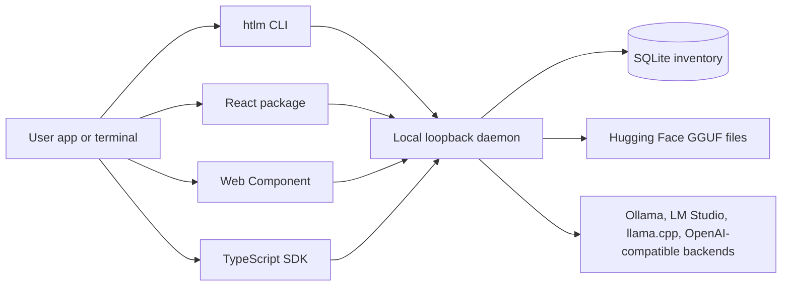

# HT Local LLM Marketplace

A lightweight local-first LLM marketplace and runtime control plane for terminals, agents, React apps, plain HTML apps, desktop shells, and OpenAI-compatible clients.

[](https://github.com/HassTech-LLC/ht-llm-marketplace/actions/workflows/ci.yml)
[](LICENSE)
[](package.json)
[](docs/security-privacy.md)
[](docs/universal-integration.md)
[](docs/agent-integration.md)

## Why This Exists

Most local-LLM tools are either full desktop studios or raw runtime CLIs. HT Local LLM Marketplace is the smaller control-plane layer between those extremes: it lets another app discover, download, verify, delete, and run local models without bundling model weights or forcing a heavy studio shell.

The repository stays intentionally small. Model files, runtime caches, downloaded GGUF artifacts, local databases, desktop build output, and proof captures stay outside source control.

## Quick Start

```powershell
npm install
npm run studio
```

The Studio dev server starts on `http://127.0.0.1:3000`. The local daemon runs on `http://127.0.0.1:3001`, or slides upward if that port is busy.

```powershell
npm run release:check
npm run bundle:local
```

`release:check` runs type checks, unit tests, compatibility smoke tests, docs checks, browser smoke, package dry-runs, package smoke, and artifact cleanliness checks.

## Use It In Another Project

HT Local LLM Marketplace is built as a set of reusable surfaces rather than one fixed app.

| Surface | Use case |
| --- | --- |
| CLI | Terminal model lifecycle, agent setup, status checks, and direct pulls. |
| SDK | Typed JavaScript/TypeScript calls into the local daemon and OpenAI-compatible routes. |
| React | Full marketplace UI embedded inside an existing app. |
| Web Component | Framework-neutral marketplace element for plain HTML, Astro, Rails, Django, Laravel, Svelte, and more. |
| Daemon | Loopback model inventory, downloads, runtime routing, safety checks, and `/v1` APIs. |
| Studio | Full local control panel for power users. |

## Terminal Marketplace

From this source checkout, call the CLI entrypoint directly so the commands resolve to this repo:

```powershell
node packages/cli/src/index.js status
node packages/cli/src/index.js targets
node packages/cli/src/index.js init --target agent --api-url http://127.0.0.1:3001
node packages/cli/src/index.js pull Qwen/Qwen2.5-0.5B-Instruct-GGUF
node packages/cli/src/index.js run qwen2.5:0.5b "Explain local-first AI in one sentence."
```

After installing the local release bundle from `npm run bundle:local` or a published `@ht-llm-marketplace/cli` package, those same commands are available as `npx htlm ...`. Avoid bare `npx htlm` before installing this CLI package; npm already has an unrelated `htlm` package.

Agent and OpenAI-compatible clients can point at the local daemon:

```powershell
$env:OPENAI_BASE_URL="http://127.0.0.1:3001/v1"
$env:OPENAI_API_KEY="local-not-needed"
```

`OPENAI_BASE_URL=http://127.0.0.1:3001/v1`

## Embed Examples

React:

```tsx
import { ModelMarketplace, type MarketplaceConfig } from "@ht-llm-marketplace/react";
import "@ht-llm-marketplace/react/styles.css";

const config: MarketplaceConfig = {
  apiUrl: "http://127.0.0.1:3001",
  theme: "system",
  branding: {
    name: "Acme Model Hub",
    tagline: "Secure local models",
    mark: "AM"
  },
  defaultQuery: "qwen coder"
};

export function LocalModels() {
  return <ModelMarketplace config={config} />;
}
```

HTML Web Component:

```html
<script type="module" src="http://127.0.0.1:3001/widget/ht-model-marketplace.js"></script>

<ht-model-marketplace
  api-url="http://127.0.0.1:3001"
  theme="system"
  brand-name="Acme Model Hub"
  brand-tagline="Approved local models"
  accent-color="#0ea5e9"
></ht-model-marketplace>
```

Python:

```python
import json
import urllib.request

payload = {"model": "local", "messages": [{"role": "user", "content": "hi"}]}
request = urllib.request.Request(
    "http://127.0.0.1:3001/v1/chat/completions",
    data=json.dumps(payload).encode("utf-8"),
    headers={"content-type": "application/json", "authorization": "Bearer local-not-needed"},
)
print(urllib.request.urlopen(request).read().decode("utf-8"))
```

More targets are covered in [`docs/universal-integration.md`](docs/universal-integration.md), [`docs/integration-profiles.md`](docs/integration-profiles.md), and [`examples/universal`](examples/universal).

## Visual Proof

Studio desktop:


Mobile:


Terminal usability:


Architecture map:


Videos:

- [Studio walkthrough](docs/assets/marketplace-demo.webm)
- [Terminal usability walkthrough](docs/assets/terminal-demo.webm)

## Architecture



| Workspace | Purpose |
| --- | --- |
| [`packages/cli`](packages/cli) | Terminal marketplace command runner. |
| [`packages/sdk`](packages/sdk) | Typed client wrappers and shared integration types. |
| [`packages/react`](packages/react) | High-fidelity React marketplace UI. |
| [`packages/web-component`](packages/web-component) | Framework-neutral custom element. |
| [`packages/daemon`](packages/daemon) | Local control plane, database, adapters, and routing. |
| [`apps/studio`](apps/studio) | Standalone browser control panel. |
| [`apps/desktop`](apps/desktop) | Desktop packaging scaffold. |

## Trust And Safety Boundaries

- DNS rebinding guard: loopback host checks reject external host headers.
- Origin filtering: state-changing browser requests must come from configured local origins.
- Privileged action confirmation: high-risk actions require explicit custom headers that force CORS preflight.
- Path traversal protection: delete plans stay inside owned model/storage roots.
- Download integrity: Hugging Face LFS SHA256 checks and byte limits protect large binary flows.
- Source footprint control: generated artifacts, local memory files, databases, model payloads, and desktop build output are ignored.

See [`docs/security-privacy.md`](docs/security-privacy.md) and [`docs/open-source.md`](docs/open-source.md).

## Verification

```powershell
npm run check
npm test
npm run build
npm run smoke:docs
npm run smoke:marketplace
npm run smoke:universal
npm run smoke:packages
npm run check:artifacts
npm run release:check
```

CI runs the full release gate on `main` and pull requests. The release workflow also supports package dry-runs and local bundle verification.

## Documentation

- [`docs/index.md`](docs/index.md): reader-oriented docs map.
- [`docs/github-repo-design.md`](docs/github-repo-design.md): GitHub positioning and proof checklist.
- [`docs/universal-integration.md`](docs/universal-integration.md): target detection and embedding targets.
- [`docs/integration-profiles.md`](docs/integration-profiles.md): footprint profiles by integration type.
- [`docs/agent-integration.md`](docs/agent-integration.md): local model wiring for agents and OpenAI-compatible clients.
- [`docs/customization.md`](docs/customization.md): branding, labels, colors, and feature toggles.
- [`docs/runtime-residency-modes.md`](docs/runtime-residency-modes.md): runtime resource modes.
- [`docs/funding-proof-dossier.md`](docs/funding-proof-dossier.md): proof assets and grant/resume positioning.
- [`RELEASE.md`](RELEASE.md): release instructions.
