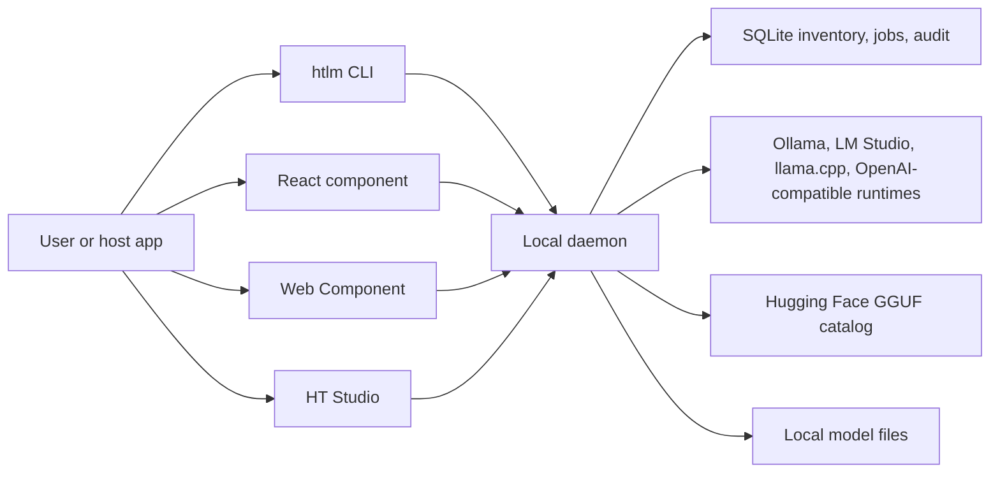
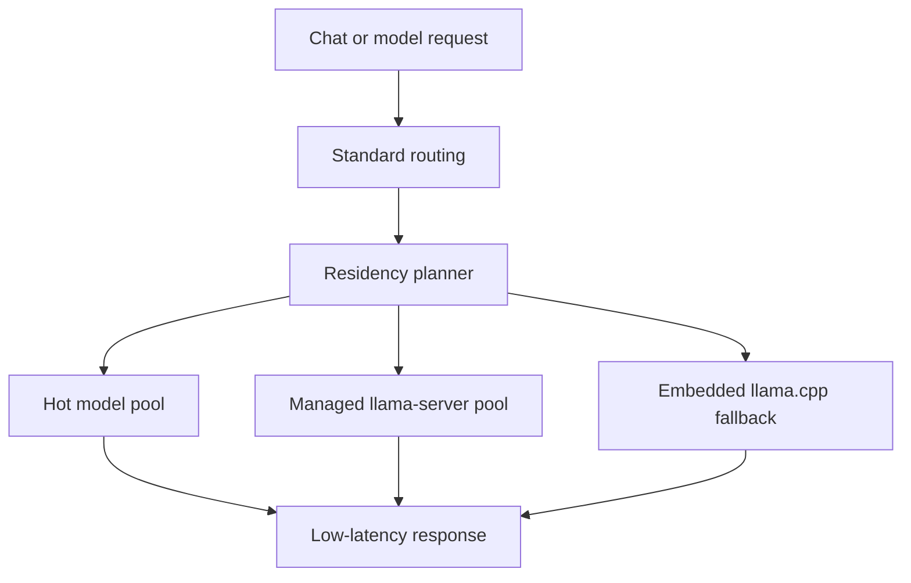

# HT Local LLM Marketplace

[](https://github.com/HassTech-LLC/ht-llm-marketplace/actions/workflows/ci.yml)
[](LICENSE)
[](package.json)
[](docs/security-privacy.md)
[](docs/universal-integration.md)
[](docs/agent-integration.md)

HT Local LLM Marketplace is a lightweight local model supply chain: a marketplace UI, terminal lifecycle, and local runtime control plane that other apps can embed without becoming a full AI studio.

It ships as a small TypeScript control plane and lets the user's machine own the heavy parts: model files, runtime state, downloads, verification, and delete plans stay local.

## What It Gives Developers

- A terminal marketplace for agents, CI, operators, and power users.
- A local daemon with OpenAI-compatible and Ollama-compatible endpoints.
- A typed SDK for host apps.
- A React marketplace component.
- A framework-neutral Web Component.
- A full Studio for users who want peak runtime controls, hot pools, and managed `llama-server`.

The practical goal: let any project discover, download, verify, load, run, and safely delete local model artifacts while keeping model state and runtime control on the user's machine.

## Why This Exists

Most local-LLM tools are either full desktop apps or backend runtimes. HT Local LLM Marketplace is designed as a reusable model supply chain that can be embedded into other products.

It is intentionally split into surfaces:

| Need | Use |
| --- | --- |
| Add a model marketplace to an existing React app | `@ht-llm-marketplace/react` |
| Add a marketplace to plain HTML, Rails, Django, Laravel, ASP.NET, CMS, or static pages | `<ht-model-marketplace>` Web Component |
| Give an agent or terminal user lifecycle control | `htlm` CLI |
| Call a local model from any OpenAI-compatible client | `http://127.0.0.1:3001/v1` |
| Build a custom product around model installs and runtime state | `@ht-llm-marketplace/sdk` |
| Run the full local Studio with peak controls | `npm run studio` |

## Size And Footprint

The repo is meant to be small as source and package code, not to pretend local models are small. GGUF files, Ollama blobs, and desktop build outputs are intentionally outside the publishable control-plane footprint.

| Layer | Current measured size | What it means |
| --- | ---: | --- |
| Tracked source | 229 files, 1.42 MiB | The GitHub repo stays compact and reviewable. |
| `@ht-llm-marketplace/cli` tarball | ~8.9 KB | Terminal lifecycle wrapper. |
| `@ht-llm-marketplace/sdk` tarball | ~10.5 KB | Typed API client and shared types. |
| `@ht-llm-marketplace/react` tarball | ~44 KB | Embeddable React marketplace UI and CSS. |
| `@ht-llm-marketplace/web-component` tarball | ~83.5 KB | Framework-neutral custom element bundle. |
| `@ht-llm-marketplace/daemon` tarball | ~128.6 KB | Local daemon, adapters, download jobs, runtime routing, delete safety. |

Large local folders such as `node_modules`, `.git`, Tauri `target`, desktop installers, downloaded models, and runtime caches are development or user-machine artifacts, not what a consuming app imports.

## System Map

| System | Tech | Comes with |
| --- | --- | --- |
| Local daemon | Node, TypeScript, loopback HTTP | `/health`, catalog search, downloads, inventory, runtime scan, safe delete plans, OpenAI-compatible routes. |
| Runtime adapters | Ollama, LM Studio, llama.cpp, OpenAI-compatible endpoints | Detect installed runtimes, pull/download models, start optional connectors, configure external compatible endpoints. |
| Managed engine path | llama.cpp / `node-llama-cpp`, managed `llama-server` support | Built-in local GGUF path, hot pools, residency modes, delegated server pool hooks. |
| Terminal marketplace | `htlm` CLI | `status`, `targets`, `init`, `search`, `files`, `pull`, `downloads`, `inventory`, `verify`, `load`, `run`, `rm`. |
| SDK | TypeScript ESM | Typed lifecycle calls for host apps and automation. |
| React UI | React 18/19-compatible package | Full marketplace component with configurable branding, theme, feature flags, and download modes. |
| Web Component | Vite-built custom element | Plain HTML/server-rendered embed for Django, Rails, Laravel, ASP.NET, CMS, Astro, Vue, Svelte, Electron, and Tauri hosts. |
| Studio | Vite app | Full user surface for marketplace, library, runtimes, compatibility scan, and peak local controls. |
| Desktop shell | Tauri scaffold | Windows desktop packaging path without committing heavy build output. |
| Release proof | Vitest, TypeScript, Playwright, package and consumer smokes | Build, browser, terminal, universal-template, package, clean-room, Docker, and installer gates. |

## Possible Product Shapes

| Product using this repo | Smallest useful profile |
| --- | --- |
| Terminal-only local model manager | `@ht-llm-marketplace/cli` |
| Hermes-style or coding agent backend | CLI plus `http://127.0.0.1:3001/v1` |
| React SaaS/admin marketplace panel | `@ht-llm-marketplace/react` plus daemon |
| Plain HTML or server-rendered app marketplace | Web Component plus daemon |
| Python/FastAPI/Django local-AI app | Web Component plus OpenAI-compatible API |
| IDE or VS Code extension | OpenAI-compatible API plus CLI lifecycle |
| Desktop local AI app | React/Web Component plus daemon, or full Studio |
| Power-user local Studio | Full repo or future desktop bundle |

## GitHub Topics

Suggested repository topics: `local-ai`, `llm`, `gguf`, `ollama`, `llama-cpp`, `openai-compatible`, `model-marketplace`, `web-component`, `react`, `typescript`, `local-first`, `ai-agents`, `desktop-ai`.

## Quick Start

From this repo:

```powershell
npm install
npm run studio
```

The daemon defaults to:

```text
http://127.0.0.1:3001
```

Run the release gate:

```powershell
npm run release:check
```

## Use It In Another Project

The npm packages are prepared for publication but are not published yet. Until then, build a local install bundle:

```powershell
npm run bundle:local
```

That creates tarballs and install scripts outside the repo under the OS temp directory. In a consuming project, use the generated `install-local.ps1` or install the tarballs directly.

After package publication, the normal flow will be:

```powershell
npm install @ht-llm-marketplace/cli
npx htlm init --target auto
npx htlm start
```

`init --target auto` inspects the current folder and prints the right snippet. You can also choose a target explicitly:

```powershell
npx htlm init --target react
npx htlm init --target html
npx htlm init --target python
npx htlm init --target django
npx htlm init --target rails
npx htlm init --target laravel
npx htlm init --target aspnet
npx htlm init --target electron
npx htlm init --target tauri
npx htlm init --target vscode
npx htlm init --target terminal
```

See the supported host matrix:

```powershell
npx htlm targets
```

## Terminal Marketplace

The CLI is a first-class product surface, not a helper script.

```powershell
npx htlm status
npx htlm search "qwen coder"
npx htlm files Qwen/Qwen2.5-0.5B-Instruct-GGUF
npx htlm pull qwen2.5:0.5b
npx htlm downloads
npx htlm inventory
npx htlm verify <artifact-id>
npx htlm load <artifact-id>
npx htlm run <model> "hi"
npx htlm rm <artifact-id>
```

Agents and local-LLM apps can point at the daemon as an OpenAI-compatible backend:

```text
OPENAI_BASE_URL=http://127.0.0.1:3001/v1
OPENAI_API_KEY=local-not-needed
```

## Embed Examples

React:

```tsx
import { ModelMarketplace, type MarketplaceConfig } from "@ht-llm-marketplace/react";
import "@ht-llm-marketplace/react/styles.css";

const config: MarketplaceConfig = {
  apiUrl: "http://127.0.0.1:3001",
  theme: "system",
  branding: {
    name: "Acme Model Hub",
    tagline: "Approved local models",
    mark: "AM"
  },
  defaultQuery: "qwen coder",
  storageKey: "acme_model_hub"
};

export function LocalModels() {
  return <ModelMarketplace config={config} />;
}
```

Web Component:

```html
<script type="module" src="http://127.0.0.1:3001/widget/ht-model-marketplace.js"></script>
<ht-model-marketplace
  api-url="http://127.0.0.1:3001"
  theme="system"
  brand-name="Acme Model Hub"
  brand-tagline="Approved local models"
  brand-mark="AM"
  accent-color="#0ea5e9"
  default-query="qwen coder"
></ht-model-marketplace>
```

Python:

```python
import json
import urllib.request

payload = {"model": "local", "messages": [{"role": "user", "content": "hi"}]}
request = urllib.request.Request(
    "http://127.0.0.1:3001/v1/chat/completions",
    data=json.dumps(payload).encode("utf-8"),
    headers={"content-type": "application/json", "authorization": "Bearer local-not-needed"},
)
print(urllib.request.urlopen(request).read().decode("utf-8"))
```

More examples live in [`examples/universal`](examples/universal).

## Visual Proof

Marketplace desktop:


Marketplace mobile:


Terminal marketplace:


Embeddable surfaces:


## Architecture



Runtime residency:



## Packages

| Package | Purpose |
| --- | --- |
| `@ht-llm-marketplace/cli` | Terminal marketplace, project initialization, daemon start. |
| `@ht-llm-marketplace/daemon` | Local HTTP daemon, scanner, downloads, runtime routing, safe delete plans. |
| `@ht-llm-marketplace/sdk` | Typed client and shared public types. |
| `@ht-llm-marketplace/react` | Reusable marketplace UI. |
| `@ht-llm-marketplace/web-component` | Framework-neutral custom element. |
| `apps/studio` | Full local Studio shell. |

## Trust And Safety Boundaries

The daemon is local-first by default:

- Runtime scans are local.
- Inventory, downloads, verification, and delete plans are local.
- Delete operations require marketplace ownership evidence.
- Privileged daemon actions require explicit confirmation headers.
- Browser access is constrained to configured loopback origins.
- Model source metadata, inferred recommendations, and verified local evidence are kept separate.

Security details live in [`docs/security-privacy.md`](docs/security-privacy.md).

## Verification

Current release verification includes:

```powershell
npm run check
npm test
npm run build
npm run check:compatibility
npm run smoke:cli-marketplace
npm run smoke:universal
npm run smoke:marketplace
npm run pack:dry-run
npm run smoke:packages
npm run check:artifacts
```

Use the single command:

```powershell
npm run release:check
```

## Documentation

Start with [`docs/index.md`](docs/index.md).

Key guides:

- [`docs/universal-integration.md`](docs/universal-integration.md): add the marketplace to any project type.
- [`docs/integration-profiles.md`](docs/integration-profiles.md): runtime-only, embed UI, Studio full, terminal-agent, and dev profiles.
- [`docs/agent-integration.md`](docs/agent-integration.md): Hermes-style agents, coding agents, local chat UIs, and OpenAI-compatible clients.
- [`docs/customization.md`](docs/customization.md): branding, tokens, features, React config, and Web Component attributes.
- [`docs/open-source.md`](docs/open-source.md): public packaging, local bundle, and contribution workflow.
- [`docs/runtime-residency-modes.md`](docs/runtime-residency-modes.md): balanced, fast-parallel, and quality-single runtime behavior.
- [`docs/security-privacy.md`](docs/security-privacy.md): local-first privacy and safety boundaries.
- [`RELEASE.md`](RELEASE.md): release checklist.

## Contributing

Read [`CONTRIBUTING.md`](CONTRIBUTING.md), [`CODE_OF_CONDUCT.md`](CODE_OF_CONDUCT.md), and [`SECURITY.md`](SECURITY.md) before opening public changes.

Keep marketplace work honest: if a feature changes the UI, it should have browser proof; if it changes terminal behavior, it should have CLI smoke coverage; if it changes an integration claim, it should be represented in the universal target matrix.
