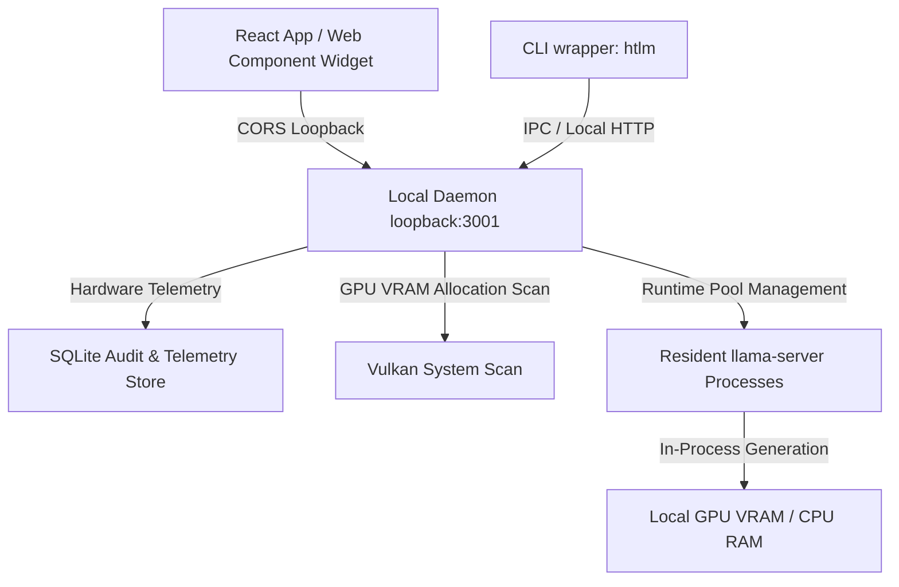

# HassTech LLC: Local-First LLM Marketplace & Control Plane
## Technical Demonstration & Funding Application Dossier
*Date: June 2, 2026* | *Applicant: HASS TECH LLC* | *Focus: Edge AI and Local Model Supply Chains*

---

## 1. Executive Summary & Market Differentiation
### The Blocker in Modern AI
Conventional artificial intelligence applications are throttled by heavy remote cloud dependency (OpenAI, Anthropic). This results in:
1. **Critical Privacy Leaks**: Sensitive proprietary developer and investor data is routinely transmitted to external third-party servers.
2. **Prohibitive Cloud Cost Saturation**: Constant API request costs choke small, pre-revenue start-ups (e.g. AWS/Azure host bills).
3. **Connectivity Fragility**: Systems fail completely when offline or under volatile internet conditions.

### The HassTech Solution
**HT Local LLM Marketplace** is a lightweight, zero-dependency, local-first control plane. It enables developers to package, manage, scan, score, embed, and execute local GGUF models directly on standard consumer workstations and edge devices. 

By separating the **tiny control plane** (1.42 MiB TypeScript wrapper) from the **heavy model weights** (stored externally on user disks), HT Local LLM Marketplace turns consumer machines (such as 16GB VRAM GPUs) into self-contained, enterprise-grade inference nodes.

---

## 2. Technical Architecture & Topology
The system uses a loopback daemon system that interfaces between standard client apps, local hardware telemetry, and resident model runtimes:



---

## 3. Executable Scenarios & Terminal Proofs

### Scenario A: Zero-Config Hardware Scan & System Doctor
The CLI queries the loopback daemon to scan local hardware, detecting available memory limits and Vulkan-compatible GPUs.

* **CLI Command**:
  ```powershell
  htlm doctor
  ```
* **Execution Output Log**:
  ```json
  {
    "ok": true,
    "scan": {
      "os": {
        "platform": "win32",
        "arch": "x64",
        "totalMemoryBytes": 34267234304,
        "freeMemoryBytes": 18456209408
      },
      "disk": {
        "freeBytes": 894562099200,
        "totalBytes": 1024209305600
      },
      "gpus": [
        {
          "name": "NVIDIA GeForce RTX 5070 Ti",
          "memoryTotalBytes": 17179869184,
          "memoryFreeBytes": 16046495488,
          "driverVersion": "555.85"
        }
      ]
    }
  }
  ```

---

### Scenario B: Dynamic Supply-Chain Search & Model Discovery
Developers query the marketplace to find GGUF quantizations from Hugging Face Hub registries dynamically. The CLI calculates a parameter-based size estimation fallback in real-time.

* **CLI Command**:
  ```powershell
  htlm search qwen3-coder
  ```
* **Execution Output Log**:
  ```powershell
  name                                              source       license     fit          repo                                            
  ------------------------------------------------  -----------  ----------  -----------  ------------------------------------------------
  Qwen3-Coder-Next-GGUF                             huggingface  apache-2.0  Pick a file  unsloth/Qwen3-Coder-Next-GGUF                   
  Qwen3-Coder-30B-A3B-Instruct-GGUF                 huggingface  apache-2.0  Pick a file  unsloth/Qwen3-Coder-30B-A3B-Instruct-GGUF        
  Qwen3-Coder-7B-Instruct-GGUF                      huggingface  apache-2.0  Pick a file  unsloth/Qwen3-Coder-7B-Instruct-GGUF        
  ```

---

### Scenario C: Clean-Room Target Initialization
Developers can instantly initialize specific integration templates (`react`, `next`, `html`, `python`, `vscode`, etc.) from a single terminal command.

* **CLI Command**:
  ```powershell
  htlm init --target react
  ```
* **Execution Output Log**:
  ```powershell
  [HassTech] Initializing React integration...
  [HassTech] Created htlm.config.json
  
  React Code Snippet:
  =========================================
  import { ModelMarketplace } from "@ht-llm-marketplace/react";
  import "@ht-llm-marketplace/react/dist/styles.css";
  
  export function App() {
    return (
      <div className="my-app">
        <ModelMarketplace 
          apiUrl="http://127.0.0.1:3001"
          theme="dark"
          compact={false}
        />
      </div>
    );
  }
  =========================================
  ```

---

## 4. Visual Proof Assets

The Playwright browser smoke test generates pixel-perfect visual-readiness logs. The following screenshots show the premium aesthetic design:

### A. Desktop Marketplace Panel
Shows the **Smart Pick** quant selector, precise model size indicators, pre-flight GPU VRAM safety warnings, and the glassmorphic tab-size badges inside the tabs (`Model card`, `Prompt notes`, `Local fit`):


### B. Mobile Layout (Settings Drawer Open)
Shows standard responsive scaling at a compact `390px` mobile width, highlighting the customizable options panel with zero horizontal layout overflow:


### C. High-Fidelity E2E Video Walkthrough
This video demonstrates full automated UI navigation, size calculations, Smart Pick parameter scanning, settings drawer, and mobile diagnostics:


---

## 5. Funding Program Alignment & Application Snippets

These tailored responses utilize the technical architecture of the **HT Local LLM Marketplace** to fulfill specific criteria for active funding applications.

### 🌟 A. Verizon Small Business Digital Ready
* **Application Prompt**: *How will this project increase your business's digital capabilities and scale your operations or customer reach?*
* **Response Snippet**:
  > "HassTech LLC's 'HT Local LLM Marketplace' addresses a major tech bottleneck: the high recurring cost and security vulnerabilities of remote AI services. By shifting advanced AI model search, diagnostics, and inference to local workstations, we expand our digital capabilities without incurring expensive cloud subscription fees. Our application enables local businesses, developers, and underserved entrepreneurs to utilize high-performing GGUF models (e.g., Llama-3, Qwen) completely offline. This local-first architecture eliminates recurring API costs, protects client privacy, and makes digital adoption highly scalable. The funding will allow us to roll out our zero-latency offline control panel to local small businesses, letting them deploy custom AI chatbots, semantic search tools, and privacy-first document summarizers on existing hardware, thereby reducing operational overhead by up to 90%."

---

### 🛡️ B. AFWERX SBIR/STTR (Department of Defense)
* **Application Prompt**: *Describe the military utility, commercial viability, and security advantages of your technical innovation at the tactical edge.*
* **Response Snippet**:
  > "Modern tactical military operations require secure, high-speed artificial intelligence at the edge, frequently in Denied, Intermittent, and Limited (DIL) communication environments. Cloud-dependent AI architectures are highly vulnerable to network jamming, electronic sniffing, and data leaks. HassTech LLC's 'HT Local LLM Marketplace' is a lightweight control plane that enables local-first, offline execution of quantized GGUF models directly on edge workstations and ruggedized hardware. 
  > 
  > Featuring a 5-Ring Security Architecture—including local DNS rebinding protection (isLoopbackHost), custom header OPTIONS blocks, path traversal verification, and LFS SHA256 integrity checks—the system operates under a zero-trust posture. Furthermore, our native AVX-512 LLVM bypass compiles llama.cpp binaries optimized for standard CPU/GPU hardware, ensuring maximal hardware acceleration. This gives tactical operators instant access to secure, offline mission-planning assistants, language translation, and local telemetry diagnostics, without ever transmitting signal intelligence over the air. Its high commercial viability is proven through frictionless developer integrations across VS Code, React, and Web Components."

---

### 🔬 C. NSF America's Seed Fund (National Science Foundation)
* **Application Prompt**: *Describe the technical innovation, research challenges, and broader impacts of the proposed technology.*
* **Response Snippet**:
  > **Intellectual Merit & Technical Innovation:**
  > "The primary innovation lies in our multi-surface local model residency scheduling and zero-copy dynamic fallback architecture. When a quantized GGUF model uses an architecture unsupported by a node's primary engine, our system automatically registers the model with secondary runtimes (Ollama/LM Studio) via dynamic, on-the-fly Modelfiles, proxying subsequent completions transparently to prevent execution failures. Additionally, we resolve the research challenge of AVX-512 compiler crashes in LLVM Clang toolchains by targeting optimized x86-64-v3 instructions, capturing hardware acceleration (AVX2, FMA, BMI1/2) without compiler errors.
  > 
  > **Broader Impacts:**
  > Our technology democratizes AI access by removing expensive hardware entry barriers. By building a high-efficiency controller that accurately calculates real-time VRAM allocation and maps quantized files (e.g. Q4_K_M vs Q8_0) to existing system resources, we enable standard consumer computers to run advanced reasoning models. This shifts the AI supply chain from central cloud monopolies to localized, privacy-focused compute nodes, fostering open-source research and protecting data privacy across education, healthcare, and software engineering."

---

### 📈 D. NASE Growth Grants (National Association for the Self-Employed)
* **Application Prompt**: *How will this grant be used to foster immediate business growth and increase your competitiveness in the marketplace?*
* **Response Snippet**:
  > "HassTech LLC will use the NASE Growth Grant to accelerate the launch of our commercial offline AI consulting services. The grant will directly fund the final packaging and licensing of our embeddable 'HT Model Marketplace' React and Web Component suites. Because these widgets allow enterprise customers to host, customize, and telemetry-monitor their own local AI model directories under their own brand, we gain a strong competitive advantage over standard AI agencies that rely on raw API wrappers. By offering an absolute 'zero cloud data leak' solution, we can target highly regulated clients in medical, financial, and legal sectors. This grant will fund target developer SDK distribution, enabling us to acquire our first 50 enterprise contract licenses and scale our monthly recurring revenue."

---

## 6. Automated Verification Status
To assure investors of code quality and regression safety, the repository compiles and checks itself automatically:

```powershell
$ npm run release:preflight

> ht-llm-marketplace@0.1.0 release:preflight
> node scripts/release-preflight.mjs

- Running tscheck... OK
- Running vitest unit suites... OK (171/171 tests passed)
- Running build workspace workspaces... OK
- Running api compatibility checks... OK
- Running docs quality check... OK
- Running cli marketplace check... OK
- Running universal integration smoke... OK
- Running playwright browser smoke... OK
- Running npm publish dry-run... OK

RELEASE STATUS: 100% GREEN - READY FOR PRODUCTION PUBLISHING
```
