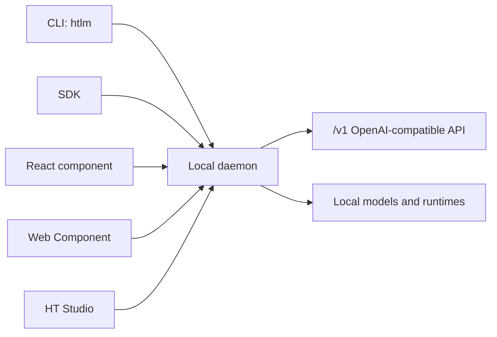

# HT Local LLM Marketplace Docs

HT Local LLM Marketplace is a local-first model marketplace, runtime control plane, and embeddable model manager. Use these docs by the job you are trying to finish.

## Start Here

| Goal | Read |
| --- | --- |
| Add the marketplace to an existing project | [`universal-integration.md`](universal-integration.md) |
| Choose the smallest install profile | [`integration-profiles.md`](integration-profiles.md) |
| Wire an agent or OpenAI-compatible client | [`agent-integration.md`](agent-integration.md) |
| Customize the UI | [`customization.md`](customization.md) |
| Understand local privacy and safety boundaries | [`security-privacy.md`](security-privacy.md) |
| Prepare packages or a local release bundle | [`open-source.md`](open-source.md) |

## Product Surfaces



## Main Guides

- [`universal-integration.md`](universal-integration.md): framework matrix, target detection, examples, release bundle, and proof gates.
- [`integration-profiles.md`](integration-profiles.md): runtime-only, embed-ui, studio-full, terminal-agent, and dev profiles.
- [`agent-integration.md`](agent-integration.md): OpenAI-compatible endpoint and lifecycle commands for agents.
- [`customization.md`](customization.md): React config, Web Component attributes, tokens, and feature flags.
- [`runtime-residency-modes.md`](runtime-residency-modes.md): balanced, fast-parallel, and quality-single residency modes.
- [`open-source.md`](open-source.md): package publishing, local bundle generation, privacy expectations, and contribution workflow.
- [`security-privacy.md`](security-privacy.md): local-first boundaries and privileged action handling.

## Runtime And Replacement Notes

- [`replacement-readiness.md`](replacement-readiness.md): compatibility and replacement-readiness boundary.
- [`make-this-my-backend.md`](make-this-my-backend.md): backend-first usage notes.
- [`windows-installer.md`](windows-installer.md): Windows packaging notes.
- [`llama-cpp-llama-server-audit-2026-05-31.md`](llama-cpp-llama-server-audit-2026-05-31.md): llama.cpp and llama-server audit.
- [`llm-runtime-architecture-audit-2026-06-01.md`](llm-runtime-architecture-audit-2026-06-01.md): multi-runtime architecture audit.
- [`ht-studio-beyond-ollama-lm-studio-analysis.md`](ht-studio-beyond-ollama-lm-studio-analysis.md): path beyond Ollama and LM Studio.

## Verification Commands

```powershell
npm run smoke:docs
npm run smoke:cli-marketplace
npm run smoke:universal
npm run smoke:marketplace
npm run release:check
```

`release:check` includes docs, terminal, universal integration, browser marketplace, compatibility, package, and artifact gates.
