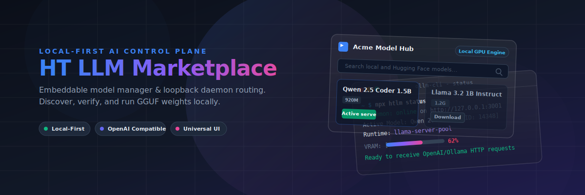
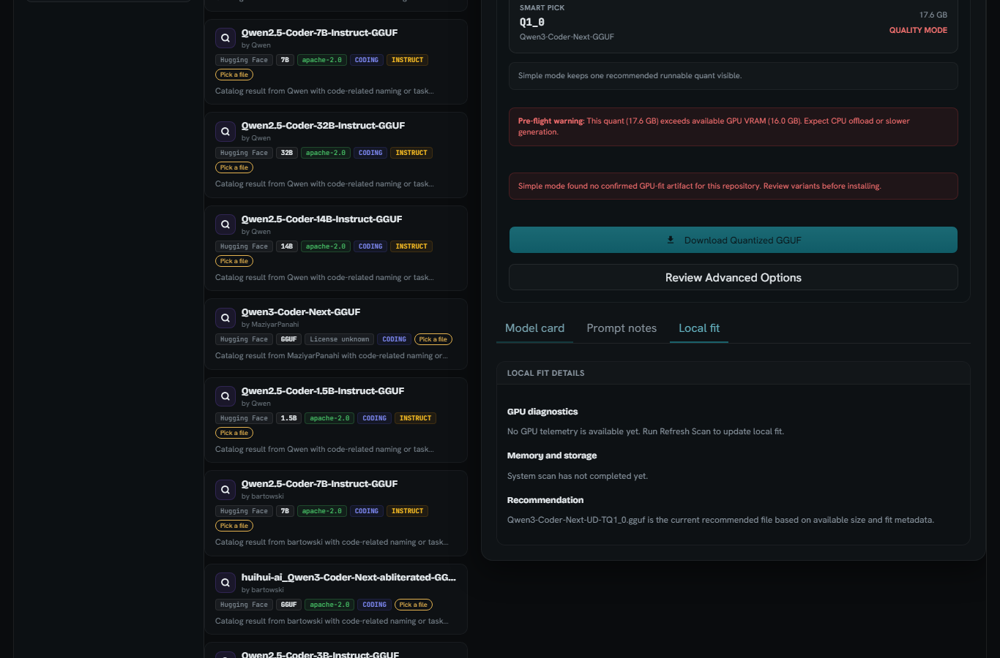
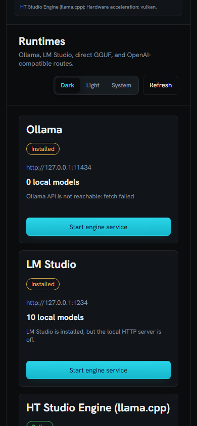
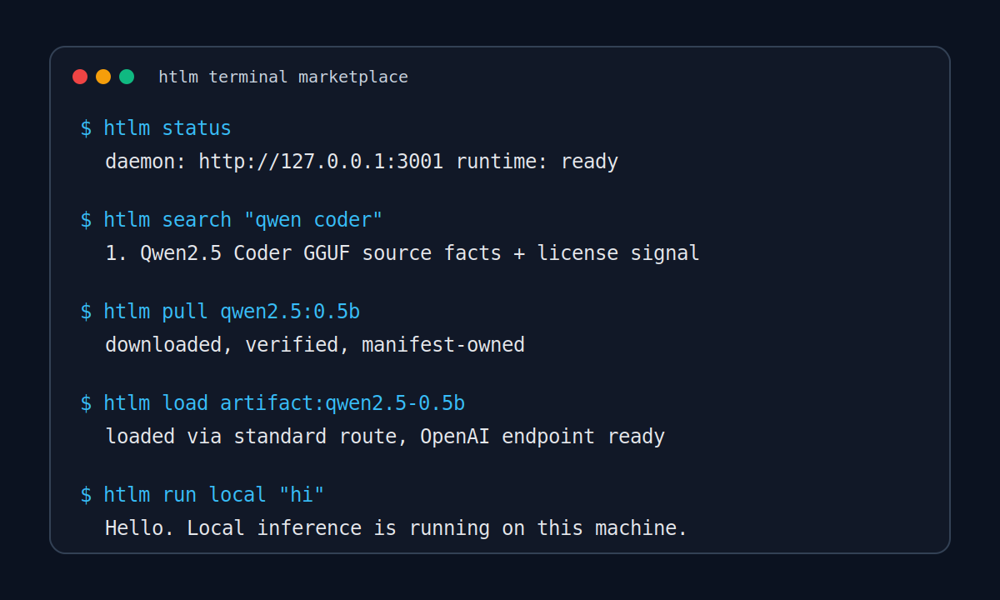
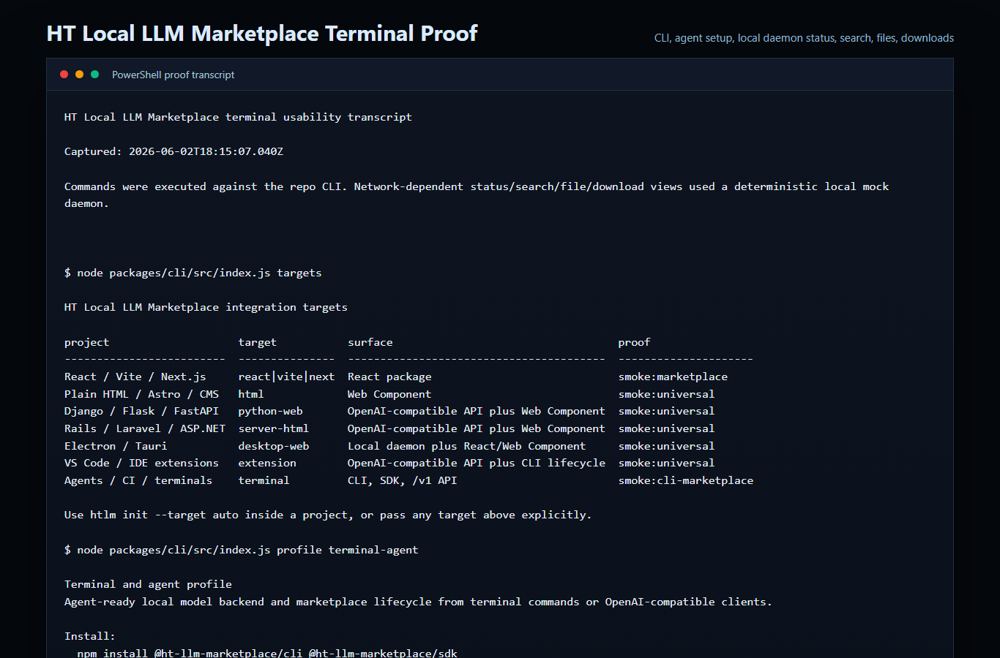
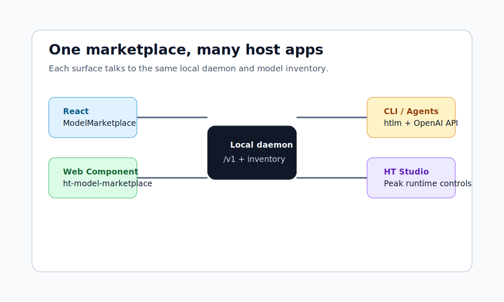
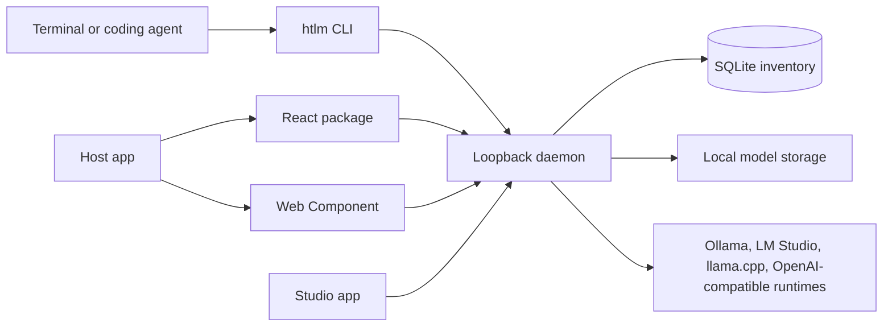

# HT Local LLM Marketplace Docs



The documentation is organized around the product surfaces developers actually use: terminal, SDK, React, Web Component, daemon, Studio, and local release workflows.

## Start Here

| Goal | Read |
| --- | --- |
| Add the marketplace to another app | [`universal-integration.md`](universal-integration.md) |
| Pick the smallest useful footprint | [`integration-profiles.md`](integration-profiles.md) |
| Wire local models to coding or terminal agents | [`agent-integration.md`](agent-integration.md) |
| Customize branding, labels, colors, and feature flags | [`customization.md`](customization.md) |
| Review security and local sandboxing | [`security-privacy.md`](security-privacy.md) |
| Prepare a clean public release | [`open-source.md`](open-source.md) |
| Understand the GitHub positioning and proof gates | [`github-repo-design.md`](github-repo-design.md) |

## Visual Proof

| Surface | Evidence |
| --- | --- |
| Studio desktop |  |
| Studio mobile |  |
| Terminal flow |  |
| Terminal usability |  |
| Embed architecture |  |
| GitHub social preview | [Social preview PNG](assets/github-social-preview.png) |
| Studio video | [Studio walkthrough](assets/marketplace-demo.webm) |
| Terminal video | [CLI usability walkthrough](assets/terminal-demo.webm) |
| Terminal transcript | [CLI transcript](proofs/terminal-logs/cli-usability-transcript.txt) |

## Product Surfaces

| Surface | Primary guide |
| --- | --- |
| CLI | [`agent-integration.md`](agent-integration.md) and [`integration-profiles.md`](integration-profiles.md) |
| SDK | [`universal-integration.md`](universal-integration.md) |
| React package | [`universal-integration.md`](universal-integration.md) and [`customization.md`](customization.md) |
| Web Component | [`universal-integration.md`](universal-integration.md) |
| Daemon and local safety | [`security-privacy.md`](security-privacy.md) |
| Runtime controls | [`runtime-residency-modes.md`](runtime-residency-modes.md) |
| Windows desktop packaging | [`windows-installer.md`](windows-installer.md) |
| Funding/resume proof material | [`funding-proof-dossier.md`](funding-proof-dossier.md) |



## Main Guides

- [`universal-integration.md`](universal-integration.md): universal target matrix and embed setup.
- [`integration-profiles.md`](integration-profiles.md): runtime-only, embed-ui, studio-full, terminal-agent, and dev profiles.
- [`agent-integration.md`](agent-integration.md): OpenAI/Ollama-compatible local agent setup.
- [`customization.md`](customization.md): config objects, Web Component attributes, labels, and tokens.
- [`runtime-residency-modes.md`](runtime-residency-modes.md): balanced, fast-parallel, and quality-single resource models.
- [`security-privacy.md`](security-privacy.md): loopback defenses, origin checks, and privileged-action headers.
- [`open-source.md`](open-source.md): release bundles, repository metadata, and publishing checks.
- [`replacement-readiness.md`](replacement-readiness.md): current runtime foundation and remaining readiness gates.
- [`llm-runtime-architecture-audit-2026-06-01.md`](llm-runtime-architecture-audit-2026-06-01.md): runtime adapter direction.
- [`llama-cpp-llama-server-audit-2026-05-31.md`](llama-cpp-llama-server-audit-2026-05-31.md): llama.cpp and llama-server integration audit.
- [`ht-studio-beyond-ollama-lm-studio-analysis.md`](ht-studio-beyond-ollama-lm-studio-analysis.md): strategic runtime comparison.

## Verification Commands

```powershell
npm run check
npm test
npm run build
npm run smoke:docs
npm run smoke:marketplace
npm run smoke:studio
npm run check:compatibility
npm run release:check
npm run release:fde-check
```

`npm run release:check` is the primary local gate before pushing public-facing repo changes.
`npm run release:fde-check` is the stronger resume/customer proof gate. It reruns release checks plus live server quality, delegated `llama-server`, managed pool, clean-room consumer install, publish dry-run, GPU proof, and Docker smoke. Use `npm run release:fde-check:ci` when Docker must be mandatory.
