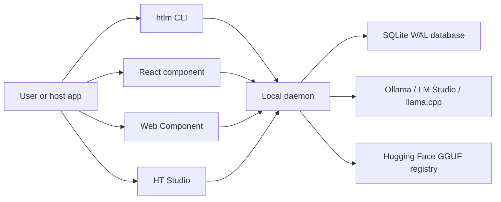

# 📚 HT Local LLM Marketplace Developer Portal

Welcome to the **HT Local LLM Marketplace** developer documentation. This portal is organized to help you integrate, customize, and configure your local-first model supply chain and runtime control plane.

---

## ⚡ Visual Demonstrations & Media

| Product Surface | Visual Proof & Walkthroughs |
| --- | --- |
| **Marketplace Studio UI (Desktop)** |  |
| **Marketplace Studio UI (Mobile)** |  |
| **Marketplace Web Component (Embeds)** |  |
| **Terminal Marketplace Flow** |  |
| **Video: Studio Live Walkthrough** | 🎥 **[Studio Walkthrough Video (assets/marketplace-demo.webm)](assets/marketplace-demo.webm)** |
| **Video: Terminal CLI Usability** | 🎥 **[CLI Usability Video (assets/terminal-demo.webm)](assets/terminal-demo.webm)** |
| **Terminal Usability Screenshot** |  |
| **Terminal Session Transcript** | 📄 **[CLI Transcript (proofs/terminal-logs/cli-usability-transcript.txt)](proofs/terminal-logs/cli-usability-transcript.txt)** |

---

## 🚀 Integration Starting Points

Find the guide corresponding to your product integration goal:

| Your Integration Goal | Read Target Guide |
| --- | --- |
| **Add a model marketplace to your existing React app** | [`universal-integration.md`](universal-integration.md) |
| **Configure a framework-neutral HTML embed** | [`universal-integration.md`](universal-integration.md) |
| **Choose the correct application footprint profile** | [`integration-profiles.md`](integration-profiles.md) |
| **Wire a local LLM backend to coding or terminal agents** | [`agent-integration.md`](agent-integration.md) |
| **Customize themes, tokens, feature flags, or branding** | [`customization.md`](customization.md) |
| **Observe local sandboxing, CORS, and loopback safety guards** | [`security-privacy.md`](security-privacy.md) |
| **Build a local release bundle or package for NPM** | [`open-source.md`](open-source.md) |
| **Review repository footprint claims & topics** | [`github-repo-design.md`](github-repo-design.md) |
| **Resolve remaining launch issues & Docker templates** | [`launch-gap-completion-plan-2026-06-01.md`](launch-gap-completion-plan-2026-06-01.md) |

---

## 🌐 Microservice System Topology



---

## 📖 Complete Documentation Registry

### Developer Integration Guides
* [`universal-integration.md`](universal-integration.md): safelisting, targets, and universal target matrix.
* [`integration-profiles.md`](integration-profiles.md): runtime-only, embed-ui, studio-full, terminal-agent, and dev profiles.
* [`agent-integration.md`](agent-integration.md): connecting standard OpenAI/Ollama compatible clients to the background daemon.
* [`customization.md`](customization.md): React configuration objects, Web Component attributes, and token adjustments.

### Architectural Audits & Deep-Dives
* [`runtime-residency-modes.md`](runtime-residency-modes.md): balanced, fast-parallel, and quality-single resource models.
* [`security-privacy.md`](security-privacy.md): five-ring loopback defenses, origin checkers, and dual-header validations.
* [`llm-runtime-architecture-audit-2026-06-01.md`](llm-runtime-architecture-audit-2026-06-01.md): local-first runtime adapters and index merging.
* [`llama-cpp-llama-server-audit-2026-05-31.md`](llama-cpp-llama-server-audit-2026-05-31.md): embedded server residency pool audits.
* [`ht-studio-beyond-ollama-lm-studio-analysis.md`](ht-studio-beyond-ollama-lm-studio-analysis.md): strategic analysis of the path beyond Ollama/LM Studio.

### Release & Distribution Procedures
* [`open-source.md`](open-source.md): building localized release bundles and managing public Git repository topics.
* [`windows-installer.md`](windows-installer.md): packaging runtime installers on Windows hosts.
* [`launch-gap-completion-plan-2026-06-01.md`](launch-gap-completion-plan-2026-06-01.md): release preflights and checklist updates.

---

## 🛠️ Verification & Pipeline Smokes

Run validation gates locally before packing or publishing:

```powershell
# Run compiler checks
npm run check

# Execute unit and mock integration test suites
npm test

# Run Playwright browser UI smoke tests
npm run smoke:marketplace
npm run smoke:studio

# Run compatibility and API conformance checks
npm run check:compatibility

# Run complete clean-room preflight validation
npm run release:check
```
